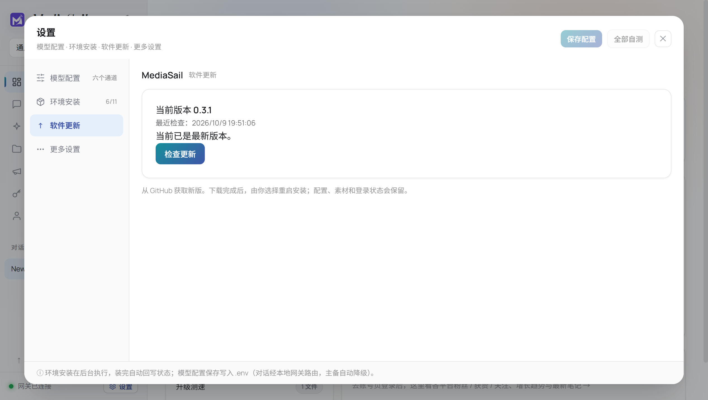

# MediaSail 0.3.1 verification

Environment: Windows 11 x64, 2026-10-09. Easel baseline and runtime versions are
unchanged from 0.3.0. No real model credentials or social-platform publication.

## Completed before publication

- 23 unit checks passed, including the restricted settings open-and-check caller,
  rejection of remote pages/iframes, shared update-operation serialization,
  checksum failure, cancellation and user-data preservation.
- Frontend TypeScript and production build passed. Packaged payload inventory
  verified all 1,012 hashes and clean workspace initialization.
- Real Electron + local HTTP fixture passed settings-triggered checking, unsaved
  model configuration retention, offline retry, invalid SHA-512 rejection, tray
  download, no automatic installation, verified-cache reuse across restart,
  busy-task installation cancellation and real local-service recovery after a
  simulated installer-launch failure. Fixture target 0.4.0 is not a real release.
- The settings screenshot was inspected; it follows the existing settings layout.
- Compared runtime file inventories/checksums inside the two actual installers:
  all 82,746 runtime files are present, with no additions/removals; the only changed
  runtime file was Chromium's diagnostic log. The build was repeated with the same
  compression level (`ELECTRON_BUILDER_COMPRESSION_LEVEL=1`) as the original build
  script, so compression-setting changes do not distort the update measurement.

## Publication and real upgrade measurement

[Release v0.3.1](https://github.com/jerryrenjianxing-sys/MediaSail/releases/tag/v0.3.1)
was published on 2026-10-09 at 18:46:59 UTC+8. All five uploaded assets were checked
against their local sizes and SHA-256 values before publication. The installer is
1,785,235,817 bytes, with SHA-256
`b9f46bde36c0839afc31450092a410712232f1255d06855614756c81e65180dc`.
All five 0.3.0 release assets remain available. Published binaries and the source
snapshot at tag commit `bd550942018fddb50135a6929f8e27dfb0f0668a` were not replaced;
this main-branch report and test-helper fixes were added after publication.

The completed run used the actual published 0.3.0 installer and public GitHub
0.3.1 feed. It began at 19:24:34 UTC+8 on 2026-10-09. Settings verification and
restoration finished at 19:51:31. The standard data and updater-cache paths were
temporarily occupied by synthetic test data; original directories were moved to
backups first. The old installer was available for differential reconstruction;
the new installer was not cached. Download/install came through the old sidebar
update window, using the unchanged source and normal SHA-512 verification.

| Measurement | Completed run |
| --- | ---: |
| GitHub check | 3.115 s |
| Installer response bodies | 3,165,970 bytes |
| Old and new blockmaps | 3,685,938 bytes |
| Other update metadata | 5,190 bytes |
| Total observed response bodies | **6,857,098 bytes (6.86 MB)** |
| Download, reconstruction and checksum validation | **28.035 s** |
| Install click to automatic new-app process launch | **730.372 s (12 min 10 s)** |
| Automatic launch to frontend and local gateway ready | **80.024 s (1 min 20 s)** |
| Install click to ready | 810.396 s (13 min 30 s) |
| Check attempts / download attempts | 1 / 1 |
| Differential transfer / full-download fallback | Yes / No |

The initial check completed automatically during startup before the sidebar was
opened. The measured 3.115 s is the actual updater check event interval, not the
time spent opening the window. The final settings-button check independently
reached "already current" against GitHub after upgrading.

Network conditions: this Windows machine's existing network configuration was
left unchanged. The end-of-test inventory showed active Wi-Fi (1.2 Gbit/s local
link) and an active VPN tunnel; WinHTTP reported no explicit proxy. The effective
VPN route and Internet bandwidth were not measured. These are local observations,
not a promise of download speed on other connections; no alternate mirror was used.

The passive recorder in `scripts/benchmark-update.cjs` counts HTTP response bodies
from the updater's existing transport, with UTF-8 byte lengths for text. Repeated
end/close notifications for one response are deduplicated by request ID, taking
the largest observed count. The table covers the initial check and download;
the separate final settings check is excluded. HTTP/TLS headers and transport
overhead are excluded, and text bodies are counted as delivered by Electron, so
this is application response-body accounting, not a packet capture. Download time
includes local reconstruction and verification. Install time includes app shutdown
and NSIS work until the actual `--updated` process appears. Readiness requires both
the original frontend and a successful live gateway status, observed in that
automatically restarted process. The observer never changes download decisions.

Only about 0.384% of the full installer size was transferred, including metadata.
The installer still replaces the full program locally; differential download does
not make installation incremental. Installation was the slowest phase in this run.

## Post-upgrade verification and recovery

- Confirmed installed version 0.3.1, automatic relaunch into the standard test
  profile, rendered original interface, and live local gateway.
- Synthetic configuration, a Chinese-path finished-content file, localStorage,
  and a persistent non-authentication cookie in the AitoEarn partition survived
  both the automatic restart and a further application restart. This verifies the
  storage mechanism, not real account validity or platform authentication.
- Settings > Software update opened the shared update window and confirmed the
  public version was current. The final screenshot is below.
- Uninstalled the temporary application, restored the original data/cache by
  renaming the backups back, and removed test-created shortcuts. Confirmed no
  registered MediaSail installation, test installation directory, or owned running
  process remained. Original cache SHA-256 matches the pre-test 0.3.0 installer.
  The recovery journal says `restored`; the result says `cleanupRestored: true`.

Two actual upgrade runs were made. The first transferred the same 6,857,098 bytes
in 34.257 s and automatically relaunched after 536.447 s, but its log-based
readiness observer timed out. It is retained as a partial observation, not counted
as a completed readiness pass. Its original data/cache were restored before the
second run. The observer was then changed to inspect the actual relaunched app.

In the second run, automatic readiness and data checks passed, but a later settings
window waiter timed out when Easel's asynchronous first-use overlay covered the
button. The helper now waits for gateway-connected UI and dismisses that original
onboarding flow before clicking. Only the remaining settings checks were resumed;
no download or installation was repeated. The published application was unchanged.
The timings above were recovered from the durable timestamped event stream, and
the final UI checks and cleanup subsequently passed. Raw local reports preserve
that recovery history; raw profiles/logs are excluded from public source bundles.
