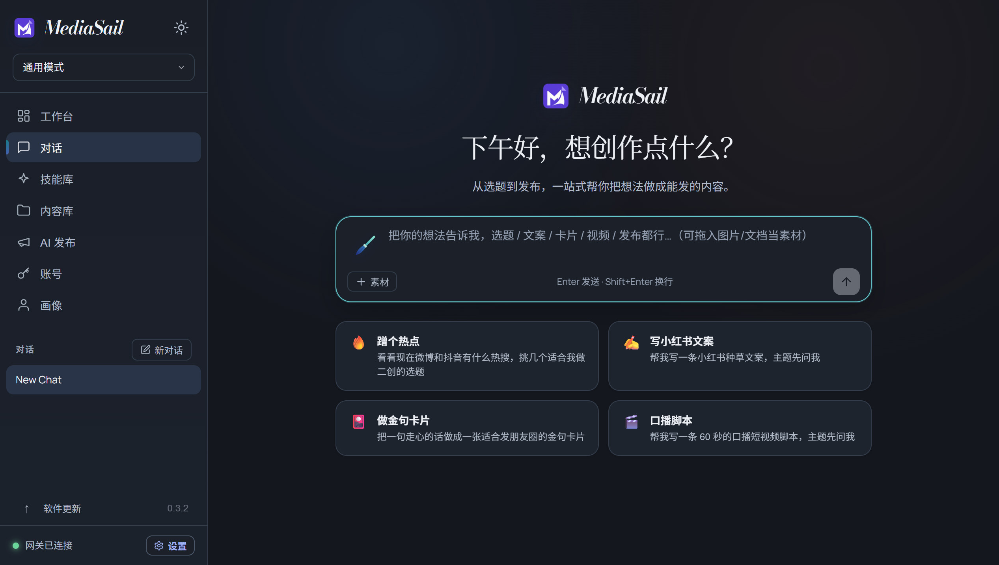

# MediaSail 0.3.2 verification

Environment: Windows 11 x64, 2026-10-10 (UTC+8). Runtime dependencies, installer
identity, user-data paths, browser partitions and update mechanism are unchanged.
No real model credentials, platform logins or social posts were used.

## Completed checks

- 26 Node test cases passed, including four Python migration scenarios: recognized
  defaults are backed up and migrated, customized identity text remains intact,
  repeated startup is idempotent, and conflicting backups stop without overwriting.
- AitoEarn tests confirm that new groups use `MediaSail 导入`, existing groups with
  the old name are not renamed, and remembered group IDs / completed drafts survive
  restart. These tests use an in-memory adapter; no cloud account was modified.
- TypeScript and Vite production build passed. All 1,014 packaged payload hashes
  matched, and clean workspace initialization passed.
- Applying all three patches to fresh files from the pinned upstream Git revision
  reproduced all 24 changed source files exactly (normalizing line endings).
  The pre-existing model-name patch was re-exported with LF bytes for clean-checkout
  reproducibility; its code changes are otherwise identical.
- Actual packaged Electron UI checks passed in both light and dark themes for the
  primary navigation, chat welcome mark, settings sections and capability menu.
  The chat and sidebar share the approved icon URL. The EXE embeds exactly the six
  resolutions from the approved ICO file; static-page icon bytes match the PNG master.
- Skill descriptions display MediaSail. Skill documentation rendering changes
  product prose while preserving executable examples, source links and authorship
  statements. Execution IDs and the underlying skill source are unchanged.
- AI publishing shell, empty send history, and import dialog branding passed.
  Read-only identity/group fixtures were supplied only inside the UI test; the
  remote website request was blocked. No upload or draft creation was attempted.
- Static fallback, introduction and one-page HTML were fetched from the actual
  packaged local server. Their titles, visible product names and icon URLs passed.
  Original copyright attribution remains in source/NOTICE, not replaced ownership.
- Screenshots were captured with finite UI animations completed and visually reviewed.

## Existing-data upgrade

An isolated packaged 0.3.1 copy initialized a disposable profile. It showed the
previous Easel chat mark before seeding configuration, Chinese-path assets and
finished content, a custom persona, a chat containing the literal word "Easel",
and a persistent non-authentication cookie in the AitoEarn partition.

The packaged 0.3.2 app then used the same profile and performed its actual workspace
migration. All seeded values survived. The default AGENTS/SOUL files now identify
MediaSail, and both original files were preserved byte-for-byte in
`.mediasail-brand-backup-0.3.2`. Historical user text and the custom persona were
not renamed. A real local gateway and the original frontend reached ready state.

This is a packaged-app/workspace compatibility check, not a repeat of the 0.3.1
NSIS installation benchmark. No installed application, registry entry, desktop
shortcut or standard user-data/cache directory was replaced.

### Browser-origin limitation observed during testing

The machine's preferred local port was already occupied. The first test pair used
different random fallback ports; the second origin could not see the first origin's
localStorage, so the history assertion failed even though the original storage
remained on disk. This is existing origin-scoped storage behavior, not deletion by
the brand migration. This release does not add cross-port storage migration.

For the successful compatibility run, the test harness selected one free local
port and used it for both versions, leaving the pre-existing service alone. The
test-only change to port selection does not change production code, update requests,
download sources or checksums. Session-retention results apply to a stable local
origin; they do not demonstrate real platform login validity or cross-port recovery.

## Screenshots

## Release checks

The installer, source snapshot, blockmap and update manifest will be checksum-checked
before the draft GitHub Release is published. After publication, an isolated 0.3.1
client will check the unmodified public feed via Settings. Results will be appended
to this report on the main branch; published version assets will not be overwritten.

To repeat the UI checks, preserve a packaged 0.3.1 baseline under the test directory
used by `scripts/smoke-branding.cjs`, then run its `seed`, `upgrade`, `ui` and (after
publication) `feed-old` modes. Profiles stay under ignored `.test-data`. The UI mode
can use `EASEL_TEST_EXE` to inspect a separate packaged copy without modifying the
runtime directory currently being archived for release.
