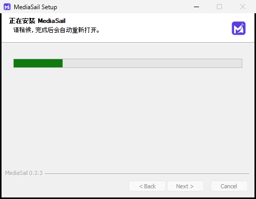

# MediaSail 0.3.3 verification

Date: 2026-10-10, Asia/Shanghai. Full Windows x64 release, same runtime versions,
installation identity, account partitions and data root as 0.3.2.

## Data and security checks

- 30 Node checks passed, including the existing Python default-identity checks.
  New cases cover merged origins, conflicting copies, more than 100 chats,
  repeated startup, deletion, corrupted-file recovery, failed writes and retry,
  forbidden keys and main-frame-only IPC access.
- The actual Chromium migration fixture created data at multiple loopback origins,
  deleted the records at one origin, and restarted before reading the snapshot.
  Only live app keys were imported; deleted records and unrelated keys were absent.
  The reader handled origins internally and did not connect to their old services.
  The larger fixture also produced three actual LevelDB table files and passed
  the same checks after compaction, including deleted-record exclusion.
- Packaged UI checks forced occupied preferred ports on two consecutive launches.
  The final run changed from port 52238 to 57072 and retained 125 nonempty chats,
  a Chinese draft, the theme changed through the real UI, a finished-content file,
  a custom persona and a persistent non-authentication AitoEarn cookie.
- The rendered migrated conversation was opened and its screenshot inspected.
  Tests used isolated profiles and no model credentials or real platform accounts.
- A packaged-app check confirmed the actual remote AitoEarn view exposes neither
  desktop state APIs nor Node. A separate remote fixture window deliberately given
  the desktop preload was still denied by the real main-process IPC handler.
- TypeScript/Vite build and 1,017 packaged payload hashes passed, including clean
  workspace initialization. New read-only CCL sources have pinned commits,
  SHA-256 records and MIT notices.
- All three upstream patches applied to a fresh export of the pinned Easel
  revision; selected modified files and the new storage module matched the build.
- The existing NSIS long-path rename/uninstall regression passed without changing
  Windows policy or touching a registered MediaSail installation.

## Installer and release gate

The [real Windows upgrade run](https://github.com/jerryrenjianxing-sys/MediaSail/actions/runs/38039594821)
passed on an ephemeral GitHub-hosted Windows runner. It installed genuine 0.3.2
into `D:\a\_temp\mediasail-installer-test\用户 自选目录`, seeded disposable data,
then ran the final 0.3.3 installer with the exact old-client arguments
`--updated /S --force-run`. The installed path was preserved exactly, including
Chinese characters and spaces, without adding a new MediaSail subdirectory.

The final draft installer was downloaded from GitHub's asset CDN through an
expiring URL limited to that one file, then checked against its SHA-256. The test
workflow retained `contents: read`; it received no GitHub account credential.
The initially attempted direct draft lookup was unavailable to that read-only
token. Application update/download behavior was not changed for this test.

| Check | Observed result |
| --- | --- |
| Visible installer | MediaSail name and purple logo; Chinese installation heading and native progress bar |
| Progress observation | 453 visible-window samples, 116 distinct native progress-control positions |
| Automatic restart | Version 0.3.3 started automatically with `--updated` in the original custom directory |
| Upgrade to restart | 1,057.259 seconds (17 minutes 37 seconds) on this test VM |
| Local service readiness | 41.840 additional seconds; 1,099.099 seconds total from upgrade launch |
| Retained data | Seeded Chinese chat, dark theme, finished-content file and persistent non-authentication AitoEarn cookie |
| Cleanup | Test uninstaller completed; installed executable no longer present |

These timings include the real installer's package verification, replacement and
restart; they are not a download benchmark or a promise for another computer.
The observer did not click through or change installation behavior. The native
progress screenshot was visually inspected. [Machine-readable result](evidence/installer-0.3.3.json).

The user's installed application is not the test target. No real account or
publishing action is used. These checks do not repeat the previous download-speed
benchmark and do not claim real platform login validity from a fixture cookie.

All five draft asset sizes and GitHub SHA-256 digests matched the local files.
Every 0.3.0, 0.3.1 and 0.3.2 release asset retained its original size and digest.
The final installer is 1,786,570,046 bytes; SHA-256:
`4d091ffa2fe4989e1a4c665e55b9e413af46f15a151529de1b8e728dd01840fb`.
[Asset verification](evidence/assets-0.3.3.json).

Application/installer source is pinned to `5d8d2a0f056950d7f9175d4b01fb9b0120f4a8fc`.
Later main-branch commits improve the verification harness and append evidence.
Published assets are not overwritten. Old-client discovery will be recorded below
after publication.

## Reproduction

- `node --test tests/*.test.cjs`
- `node scripts/test-ui-migration.cjs` (local Electron fixture; bundled Python required)
- `node scripts/test-ui-migration.cjs --sst` (larger fixture producing database tables)
- `node scripts/smoke-state.cjs` (packaged build; optional `EASEL_TEST_EXE` for a copy)
- GitHub Actions: **Verify actual Windows installer** (ephemeral hosted runner only)

Backups live under `ui-state-migration-0.3.3`. The original browser storage remains
untouched. A failed initial migration stops at the startup retry page instead of
opening an empty chat list and persisting it. `ui-state.json.previous` is the last
valid saved snapshot; damaged main files are retained separately before recovery.
