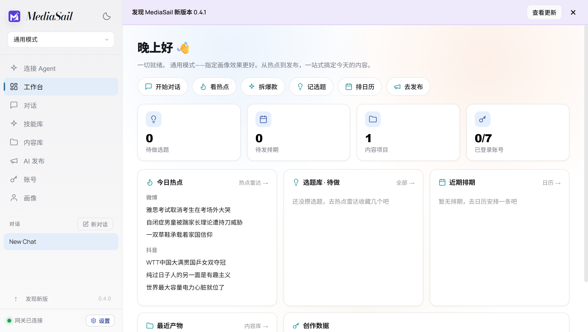
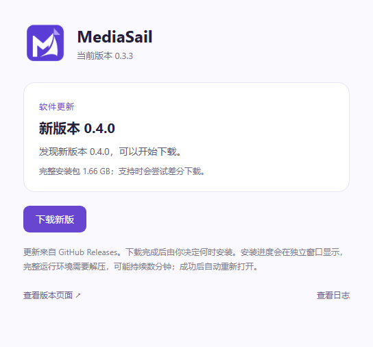

# MediaSail 0.4.0 verification

Date: 2026-10-10 (Asia/Shanghai). Same runtime versions, installation identity,
user data root and account partitions as 0.3.3.

## Implemented and verified locally

- 32 Node checks passed: existing state migration, publishing adapter and update
  checks, plus secret-free discovery, instance replacement, startup check
  deduplication, process-lifetime dismissal and restricted banner IPC.
- TypeScript/Vite build passed. All 1,063 packaged payload hashes and packaged
  Skill entrypoints verified.
- All three upstream patches applied to a fresh initialized export of the pinned
  Easel commit. All 54 changed upstream files matched the working sources after
  line-ending normalization.
- Built-in skill validation passed. The bundled OpenAPI reference contains 58
  current upstream API paths and is regenerated by the build script.
- The real packaged 0.4.0 app copied the connection prompt to the Windows clipboard.
  A denied-clipboard fixture exposed the same content in the manual-copy dialog
  (Windows clipboard CRLF and textarea LF normalized for comparison).
- The complete Skill ZIP and Markdown endpoint were read; explicit-only Codex
  metadata was retained. No model key, desktop token or login state is distributed.
- The actual PowerShell helper found the bundled runtime and checked a live
  instance; the real profile API read and updated a disposable Chinese persona.
  The existing manifest script registered a generated Chinese Markdown file, and
  its project appeared in both the API tree and the rendered content library.
- Relaunch with the previous port occupied changed 7860 to 61498, retained the
  profile and content, and connected using the refreshed descriptor. A reachable
  wrong-instance fixture was rejected. After exit, local paths were still reported
  while connection status correctly indicated offline.
- Each of two launches made one automatic update check. Manual offline/retry
  checks accounted for two additional metadata requests. Dismissal survived page
  navigation, renderer reload, and tray hide/show; a new process showed it again.
- Banner actions opened the existing update window. The AitoEarn view followed
  the viewport when the banner closed. This used an inert page fixture in the
  existing isolated partition, not a real platform account.
- The existing HTTP updater integration passed offline retry, SHA-512 rejection,
  tray download, no automatic installation, verified-cache reuse after restart,
  task cancellation before install, and service recovery after a fixture installer
  failure. The fixture download is inert bytes and is never executed.

[Machine-readable feature evidence](evidence/agent-0.4.0.json).

## Screenshots

The screenshots below come from the packaged **0.4.0** app. The banner's **0.4.1**
is deliberately supplied by a local test feed to exercise future-update states;
it is not a published release.

## Release and real upgrade

Published [v0.4.0](https://github.com/jerryrenjianxing-sys/MediaSail/releases/tag/v0.4.0)
on 2026-10-10 at 20:17 China time. All five release files were uploaded to a draft
first. GitHub's server-computed SHA-256 digests and sizes matched the local files
before publication; every asset of 0.3.0, 0.3.1, 0.3.2 and 0.3.3 was unchanged.
See [asset verification](evidence/assets-0.4.0.json), recorded while still a draft.
The final installer is 1,786,974,966 bytes; its SHA-256 is
`830572217f4fba43fb596bed5cef64810ae890b6b981ff98f38c2a3101a01a47`.

The application and source ZIP are pinned to `5dddb74`; later commits update
build cleanup, verification automation and evidence without changing the shipped
application. The source checks also passed on `3ab4b5a`.

Hosted real-upgrade verification runs separately from the fixtures above. Its
final evidence is appended after it completes; the local tests do not claim that
a simulated install is a real upgrade.

The hosted workflow installs genuine 0.3.3 into a disposable Windows custom path,
uses its unchanged GitHub updater to discover/download/install 0.4.0, checks the
automatic restart, local service, retained chat/theme/content/persona and
non-authentication cookie, then uninstalls the test copy. It cannot run on the
user's local machine. No real account or publishing operation is used.

## Reproduction

The [first full hosted attempt](https://github.com/jerryrenjianxing-sys/MediaSail/actions/runs/38049893325)
confirmed that genuine 0.3.3 discovers public 0.4.0 and completes the actual download
and checksum verification in about **40.5 seconds** on the GitHub-hosted runner.
It did not establish installation success: the controller stopped reporting after
requesting installation and the job reached its 90-minute limit. This elapsed
time includes baseline setup and waiting for publication and is not an install
speed measurement. A previous preparation-only run was cancelled before this
attempt to finish packaging; neither run is presented as a successful upgrade.
The follow-up harness bounds waits and persists installer window, process and log
diagnostics before cleanup. The published installer has not been changed.

[Attempt log](evidence/upgrade-attempt-2.log).

## Reproduction commands

- `node --test tests/*.test.cjs`
- `python scripts/export-agent-api.py`
- `node scripts/export-patches.cjs`
- `npm run pack`
- `node scripts/smoke-agent.cjs`
- `node scripts/smoke-updates.cjs`
- GitHub Actions: **Verify MediaSail 0.4 upgrade through GitHub**

The user's installed application and default profile were not test targets.
