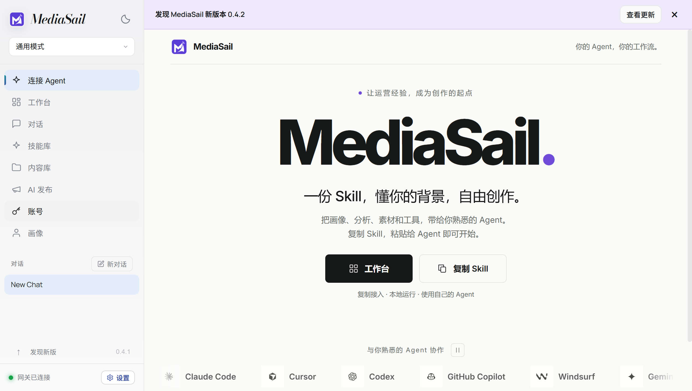
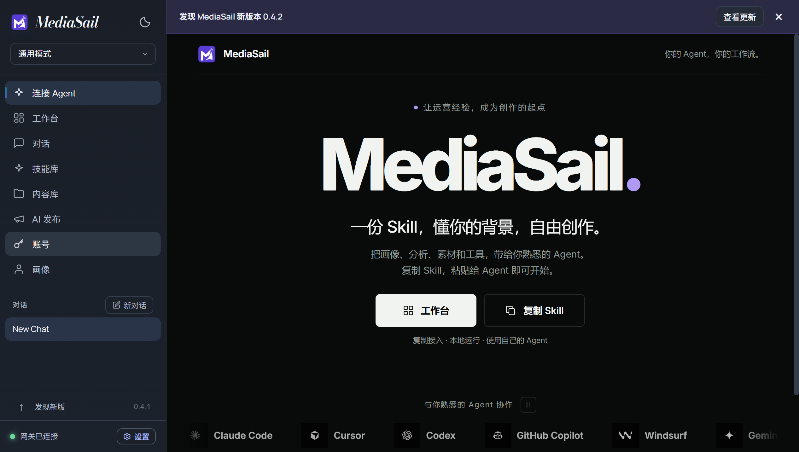
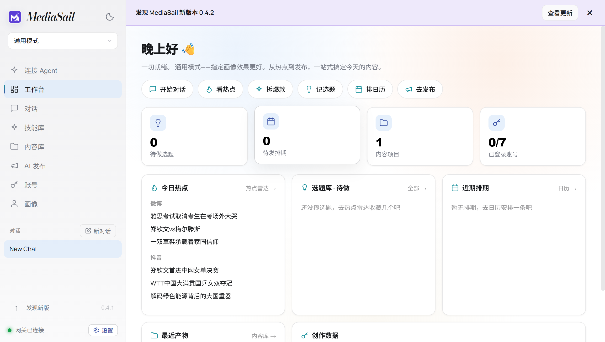

# MediaSail 0.4.1 verification

This patch includes the 0.4.0 Agent connection and startup-banner features. The
original 0.4.0 release remains available as a prerelease, with its assets unchanged.
It was removed from the stable channel after the real Windows upgrade stalled.

## Installer repair

The stock electron-builder 26.15.3 Shell `CopyFiles` step was reproduced failing on
a deep Unicode directory in a disposable local fixture. Copying the full packaged
tree also stopped partway, leaving 70,880 files missing. The earlier 0.4.0 hosted
failure displayed the template's generic "MediaSail cannot be closed" dialog;
that message alone does not identify the exact failing file or operation.

The patched extraction macro uses Windows Robocopy for the post-extraction copy,
checks its exit code, retains a Unicode copy log, and stops instead of reporting
success after a failed copy. It does not change download verification, installed
runtime versions, application identity, data paths or account partitions.
The pinned builder template is hash-checked and patched by
`scripts/prepare-installer.cjs` on every installer build after `npm ci`.

Passed local checks:
- 32 application tests, including startup reminder and isolated Agent discovery.
- All 1,063 packaged payload hashes and clean workspace initialization.
- NSIS reproduction of the stock deep-directory failure, successful replacement
  copy with exact Unicode content, and the actual Nsis7z extraction/copy pipeline.
- Missing-source failure exits with code 2, keeps its log and does not execute the
  success branch.

The copied Skill, light/dark page, startup reminder, port changes and offline
behavior are rechecked against the packaged 0.4.1 application before compression.
Release checks and the real hosted upgrade result will be appended after they run.
No test targets the user's installed app or real platform accounts.

## Packaged feature check

The final 0.4.1 packaged app passed the full Agent/banner integration again at
2026-10-10 22:21 China time. The service changed from port 7860 to 53527; discovery
and tools continued working. The fixture observed two automatic checks across two
launches and two manual checks, without downloads. Profile read/write, actual
manifest-tool content import, clipboard fallback, bundled runtimes, dark/light UI,
tray restore, dismissed-banner persistence, stale-service rejection and offline
recovery all passed. The previous long-path uninstaller regression also passed.

[Feature evidence](evidence/agent-0.4.1.json).
The screenshot banner uses a local **0.4.2 fixture**, not a published update.

