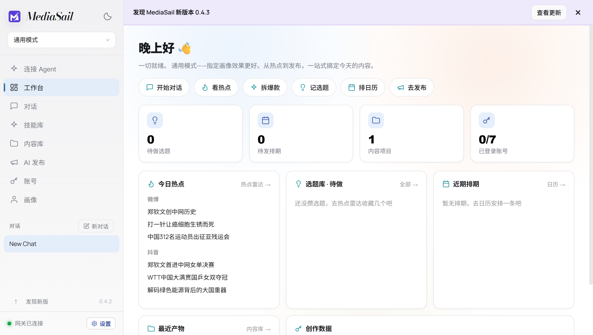
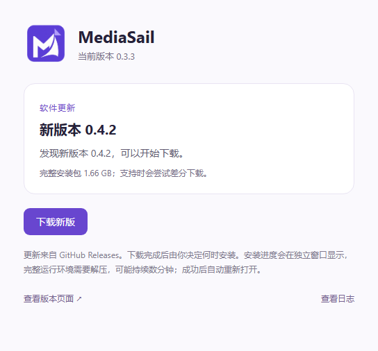
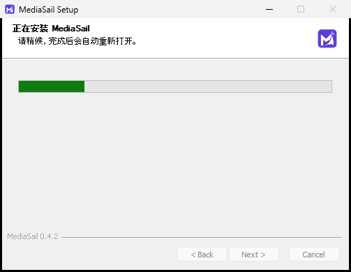

# MediaSail 0.4.2 verification

This release includes the complete 0.4.0 Agent connection/startup update-banner
features, the 0.4.1 long-path installer copy repair, and a compatibility repair for
old uninstallers' rollback temporary paths. 0.4.0 and 0.4.1 were retained as
prereleases after upgrade verification did not pass. Their assets are unchanged.

## Old-uninstaller compatibility

The 0.4.1 hosted upgrade had not reached the recorded `old-version-removed` stage.
Free-space changes showed files moving back during the legacy uninstall operation;
it was cancelled before an installation success was established. A separate,
corrected NSIS fixture reproduced a child uninstaller's normal-TEMP Rename failure
with long paths. Passing an extended-length form of that same temporary directory
to the child made the same file operation succeed with exact contents.

The incoming installer now scopes TEMP/TMP changes around the old-uninstaller
process only. It preserves its exit code and execution-error flag and restores
both environment values after success or launch failure. No persistent environment
or registry settings are changed. The hash-checked pinned-template patch wraps
both normal and fallback old-uninstaller calls; the known 0.1.0 compatibility retry
uses the same wrapper. The new-file copying repair remains in place.

The regression fixture verifies:
- Normal TEMP reproduces the old child Rename failure.
- The actual installer wrapper permits the same deep Unicode destination.
- Moved contents match, child exit code 17 is preserved, and launch errors propagate.
- Parent TEMP/TMP are restored after both success and failure.
- No registered installation or real user profile is used.

The UI/application code is unchanged from the packaged 0.4.1 feature check:
[Agent and banner evidence](evidence/agent-0.4.1.json), including copied Skill,
profile updates, actual content-library import, light/dark themes, port changes,
startup/dismissal behavior, tray restore and offline recovery. Only the application
version and incoming installer compatibility changed in 0.4.2. The final hosted
run below also checks the actual new version, local service and Agent page.

Release assets and the passing real 0.3.3 upgrade result are recorded below.

## Final packaged feature check

The packaged 0.4.2 application passed the complete Agent/startup-banner integration
again at 2026-10-10 23:05 China time. This includes actual clipboard and fallback,
Skill ZIP/Markdown, profile read/write, manifest-tool import visible in the content
library, bundled Python/Node, light/dark themes, one automatic check per launch,
no automatic download, dismissal across navigation/tray/reload, reminders on the
next launch, AitoEarn view bounds, offline recovery, stale identity rejection and
a port change from 7860 to 62261.
[Machine-readable evidence](evidence/agent-0.4.2.json).
The screenshots use a local **0.4.3 fixture** to demonstrate an available update;
0.4.3 is not a published release.

## Release

Published v0.4.2 at 2026-10-10 23:07:29 China time. All five assets were checked in
the draft using GitHub's server SHA-256 and size. All assets of the six earlier
releases (0.3.0 through 0.4.1) were retained unchanged.
[Asset verification](evidence/assets-0.4.2.json).

The installer is 1,786,976,397 bytes, SHA-256
`8090a8f1bf2e32736e9b5316a08569b18a4524649328d8277132f2d2dd48eee7`.
Application/source ZIP are pinned to `3f36531`. The release-upload courier moved
3,840,686 bytes and reconstructed that exact complete binary, verified locally,
on the publishing runner, and by GitHub's asset digest. It was then removed from
the draft. This did not change the application's updater or its download source.

## Real 0.3.3 → 0.4.2 upgrade: passed

The [GitHub-hosted Windows run](https://github.com/jerryrenjianxing-sys/MediaSail/actions/runs/38061369185)
completed successfully at 2026-10-10 23:21:50 China time. It installed the genuine,
hash-verified 0.3.3 release into `D:\a\_temp\mediasail-agent-upgrade\用户 自选目录`,
then used that old application's unchanged GitHub updater to discover, download,
verify and install the published 0.4.2 release. No download source, checksum or
installation was simulated. The old client supplied `--updated /S --force-run`;
the new installer nevertheless displayed the actual installation progress page.

The automatic restart used the same custom Unicode/space-containing directory.
The new version and real local gateway became ready. The seeded Chinese chat,
dark theme, output file, custom persona and AitoEarn-partition test cookie survived.
The test cookie was synthetic and did not authenticate an account. The Agent page
opened, its new connection descriptor reported 0.4.2, and checking GitHub again
reported that 0.4.2 was current. All assertions passed. The disposable installation
was then uninstalled successfully (`cleanedUp: true`); the hosted VM was discarded.
The user's local installation and real account data were not used.

| Measurement | Result |
| --- | ---: |
| Successful version check after GitHub exposed the release | 0.470 seconds |
| Changed installer payload downloaded | 3,830,314 bytes (3.83 MB / 3.65 MiB) |
| Download, reconstruction and checksum, as observed by the test | 11.119 seconds |
| Install request → automatically relaunched process | 11 minutes 4.121 seconds |
| Relaunched process → local gateway and main page ready | 38.145 seconds |
| Install request → local gateway and main page ready | 11 minutes 42.266 seconds |

These are observations on an ephemeral GitHub-hosted Windows runner on
2026-10-10, using its GitHub network route; they do not predict a user's local
download or disk speed. The payload count excludes update metadata, blockmaps,
HTTP/TLS overhead and the separately downloaded baseline installer. This run
did not measure total wire bytes. The old installer remained available for
differential reuse. The updater log shows 186 changed blocks and successful
differential download, with no full-download fallback or download retry recorded.
Earlier checks while the release was unpublished/cached are excluded from the
single successful-check timing. Most elapsed time remained in installing the
complete runtime, despite the small network payload.

The installer reached `old-version-removed`, `copying-files`, `files-copied` and
`succeeded`. Its copy log reports all **85,286 files** copied, with zero failed or
mismatched files. This validates both the incoming compatibility repair for the
old uninstaller and the new long-path file-copy operation on the complete bundle.

Evidence: [result](evidence/upgrade-0.4.2.json),
[updater log](evidence/upgrade-0.4.2-updates.log),
[copy log](evidence/upgrade-0.4.2-copy.log).

Real platform login and publishing remain for the user to verify with their own
accounts. No real social account or publication was used in these tests.
